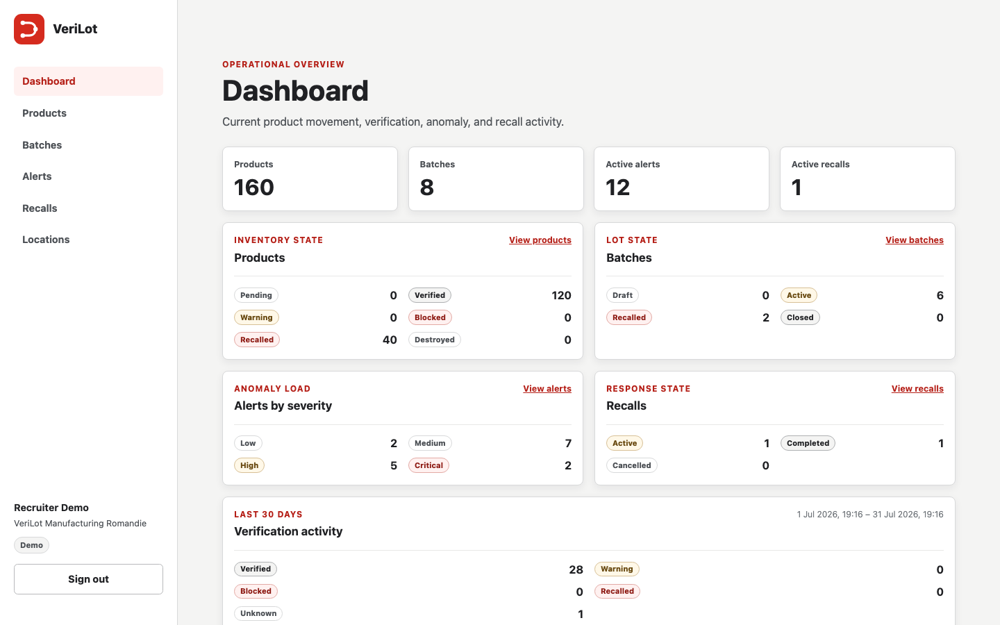
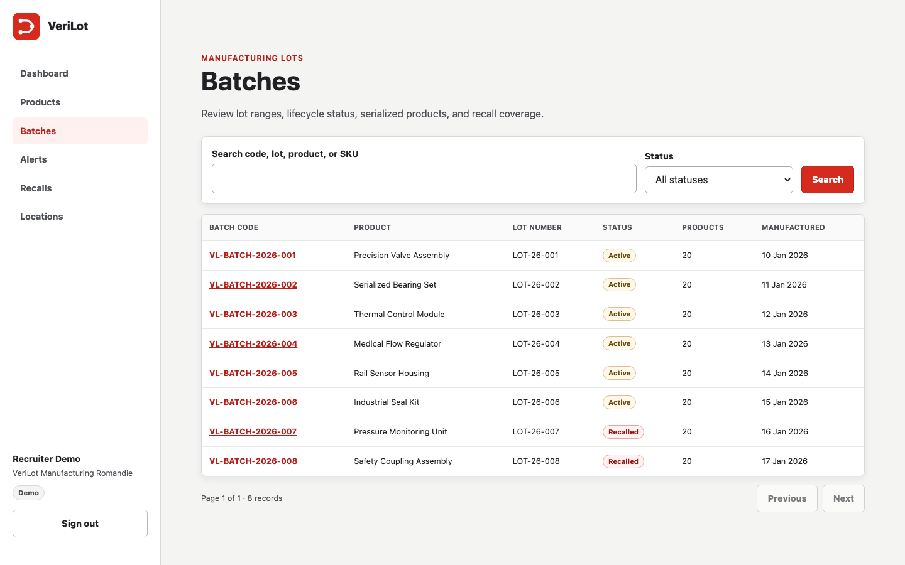
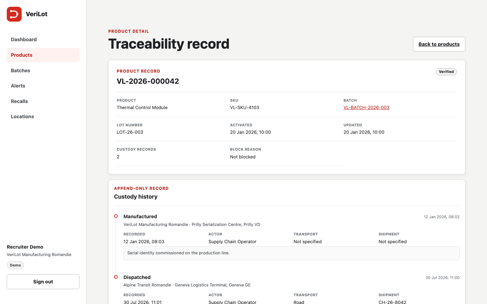
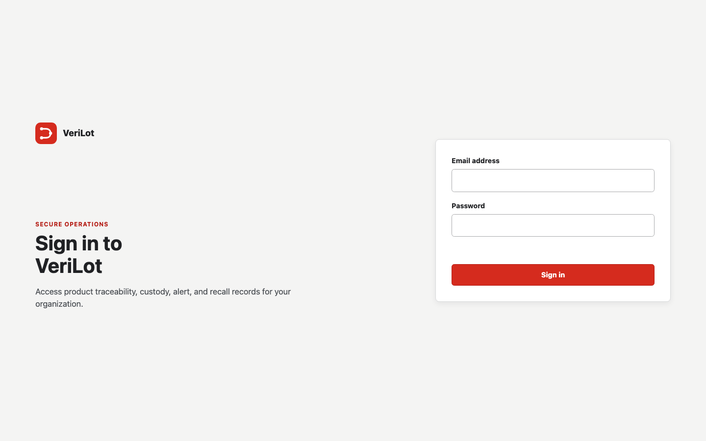
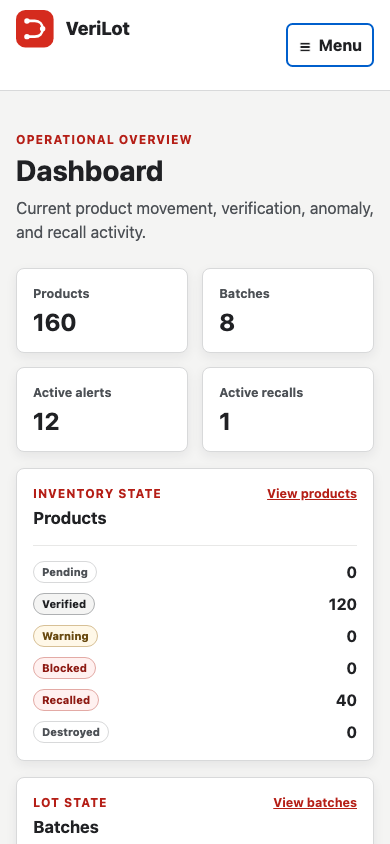
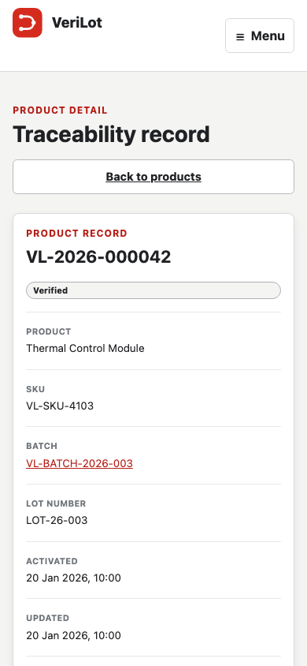

# VeriLot

VeriLot is a full-stack product traceability platform for serialized inventory, custody history, anomaly response, and recalls.

## Live portfolio

| Resource                      | URL                                                                                        |
| ----------------------------- | ------------------------------------------------------------------------------------------ |
| Application                   | [verilot-seven.vercel.app](https://verilot-seven.vercel.app)                               |
| Interactive API documentation | [verilot-api.vercel.app/api/docs/](https://verilot-api.vercel.app/api/docs/)               |
| OpenAPI JSON                  | [verilot-api.vercel.app/api/openapi.json](https://verilot-api.vercel.app/api/openapi.json) |

> **Public demo — read-only**
>
> Email: `demo@verilot.local`<br>
> Password: `VeriLotDemo2026!`
>
> The account can explore operational records but cannot create or change production data. The API independently enforces the same restriction.

### Recruiter review

1. Sign in with the public demo account.
2. Review the dashboard, then open batches and products.
3. Open product `VL-2026-000042` to see its append-only custody history.
4. Review alerts, recalls, and locations; restricted administration and mutation controls are intentionally unavailable.

## Product tour

| Dashboard                                                            | Manufacturing batches                                               |
| -------------------------------------------------------------------- | ------------------------------------------------------------------- |
|  |  |

| Product traceability and custody                                                           | Secure sign-in                                        |
| ------------------------------------------------------------------------------------------ | ----------------------------------------------------- |
|  |  |

| Mobile dashboard                                                   | Mobile product record                                                 |
| ------------------------------------------------------------------ | --------------------------------------------------------------------- |
|  |  |

## Capabilities

- Dashboard summaries for product, batch, alert, recall, verification, and custody activity.
- Searchable serialized products with lot data, status, block reason, and chronological custody evidence.
- Batch lifecycle records with manufacturing details, product counts, status filters, and recall coverage.
- Alert investigation views with severity, rule, evidence, related records, assignment, resolution, and dismissal workflows.
- Recall response records with affected batches and completion workflows.
- Organization locations and organization-scoped users.
- Public and partner verification APIs with separate rate limits.
- Interactive Swagger UI and a versioned OpenAPI document.

## Roles and permissions

| Role          | Access                                                                                |
| ------------- | ------------------------------------------------------------------------------------- |
| Administrator | All reads and current mutations, including audit records and user-assisted workflows. |
| Operator      | Operational reads, batch lifecycle changes, and custody-event recording.              |
| Inspector     | Operational reads and alert management.                                               |
| Demo          | Dashboard, product, batch, alert, recall, and location reads only.                    |

Permissions are checked in both the interface and API. Organization scope comes from the authenticated session rather than a browser-supplied organization identifier, and inaccessible cross-organization records are not disclosed.

## Security model

- Signed, HTTP-only cookie sessions; the browser never stores session or CSRF values in web storage.
- Same-origin browser API flow through a Vercel rewrite, with origin and CSRF checks on authenticated mutations.
- Route-level permissions and read-only demo enforcement in Express middleware.
- Idempotency keys and persisted outcomes for mutation retry safety.
- Append-only custody and audit evidence at the database layer.
- PostgreSQL-backed rate limits for login, public verification, and partner verification.
- Structured logging that redacts authorization material, cookies, API keys, CSRF values, credentials, and request bodies.
- Helmet security headers, request validation with Zod, bcrypt password hashing, signed tokens, and organization-scoped repositories.

## Architecture

The npm workspace shares TypeScript contracts across three packages:

- `apps/web` — React 19, React Router 8, and Vite 8.
- `apps/api` — Express 5, Prisma 7, PostgreSQL repositories, Swagger UI, and OpenAPI.
- `packages/contracts` — API paths, request and response types, permissions, and domain constants.

In production, Vercel serves the React application and rewrites same-origin `/api/*` requests to the Express deployment. The API connects to hosted Neon PostgreSQL through Prisma's PostgreSQL adapter. This preserves the same cookie, origin, and CSRF model used by local development while keeping browser traffic on one visible origin.

## Technology stack

| Area                 | Technology                                                     |
| -------------------- | -------------------------------------------------------------- |
| Language and runtime | TypeScript 5.9, Node.js 24, npm 11                             |
| Web                  | React 19, React Router 8, Vite 8                               |
| API                  | Express 5, Zod 4, Helmet 8, Pino                               |
| Data                 | PostgreSQL, Prisma 7, Neon                                     |
| Authentication       | Signed HTTP-only sessions, bcrypt, JOSE, CSRF tokens           |
| Testing              | Vitest, Testing Library, Supertest, Playwright                 |
| Hosting              | Vercel web and Express projects with a same-origin API rewrite |

## Deployment and sample data

The hosted database has three committed Prisma migrations. Its protected `public-demo` seed profile contains representative multi-organization data: 4 organizations, 5 users, 8 locations, 8 batches, 160 products, 250 custody events, 16 alerts, 2 recalls, 120 audit records, and 1 API client.

The public demo profile uses fictional portfolio data. Its demo role has no mutation permissions, while API middleware still validates origin, authentication, CSRF, and permissions on attempted writes.

## Application and API routes

The main web routes are `/sign-in`, `/dashboard`, `/products`, `/products/:productId`, `/batches`, `/batches/:batchId`, `/alerts`, `/alerts/:alertId`, `/recalls`, `/recalls/:recallId`, `/locations`, and administrator-only `/audit` routes.

API discovery and verification endpoints:

- `GET /api/health`
- `GET /api/docs/`
- `GET /api/openapi.json`
- `GET /api/v1/verification/:serialNumber`
- `GET /api/partner/v1/verification/:serialNumber`

Authenticated `/api/v1` routes cover session, dashboard, products, custody events, batches, alerts, recalls, locations, users, and audit records. Their precise schemas and response codes are documented in the live OpenAPI interface.

## Verified quality

Latest completed validation:

- API: 24 Vitest files, 111 tests passed.
- Web: 13 Vitest files, 67 tests passed.
- Local browser suite: 5 Playwright files, 21 tests passed.
- Production browser review: demo login, logout and re-login, nested-route refresh, route data, protected controls, expected `403 INSUFFICIENT_PERMISSIONS`, console/network monitoring, and six responsive sizes.
- Contracts, API, web, and full-workspace type checks passed.
- API, web, and full-workspace production builds passed.

Responsive browser coverage uses 320 × 568, 390 × 844, 430 × 932, 768 × 1024, 1024 × 768, and 1440 × 900. The checks cover page-level horizontal movement, mobile navigation, record layouts, dialogs, nested routes, and production data loading.

## Local setup

Requirements:

- Node.js 24
- npm 11
- PostgreSQL with permission to create local databases and apply migrations

Install dependencies and create local configuration:

```sh
npm install
cp apps/api/.env.example apps/api/.env
createdb verilot
createdb verilot_test
npm run db:generate
npm run db:migrate
npm run db:seed
```

Run the API and web development servers in separate terminals:

```sh
npm run dev:server
```

```sh
npm run dev:web
```

The Vite development server proxies `/api` to the API so browser security behavior matches production.

### Environment-variable names

The API template documents these names without production values:

| Name                                     | Purpose                                            |
| ---------------------------------------- | -------------------------------------------------- |
| `NODE_ENV`                               | Runtime mode                                       |
| `APP_ORIGIN`                             | Allowed browser origin for authenticated mutations |
| `HOST`                                   | API bind host                                      |
| `PORT`                                   | API port                                           |
| `LOG_LEVEL`                              | Structured logging threshold                       |
| `DATA_HASH_SECRET`                       | Deterministic sensitive-data hashing material      |
| `JWT_SECRET`                             | Session-token signing material                     |
| `SESSION_TTL_HOURS`                      | Session lifetime                                   |
| `RATE_LIMIT_LOGIN_MAX`                   | Login limit                                        |
| `RATE_LIMIT_LOGIN_WINDOW_SECONDS`        | Login window                                       |
| `RATE_LIMIT_PARTNER_MAX`                 | Partner verification limit                         |
| `RATE_LIMIT_PARTNER_WINDOW_SECONDS`      | Partner verification window                        |
| `RATE_LIMIT_VERIFICATION_MAX`            | Public verification limit                          |
| `RATE_LIMIT_VERIFICATION_WINDOW_SECONDS` | Public verification window                         |
| `DATABASE_URL`                           | Pooled application database URL                    |
| `DIRECT_URL`                             | Direct Prisma database URL                         |

Optional development and controlled-task names are `VITE_API_PROXY_TARGET`, `VITE_API_BASE_URL`, `SEED_PROFILE`, `DEMO_PASSWORD`, `PRISMA_USER_CONSENT_FOR_DANGEROUS_AI_ACTION`, `PLAYWRIGHT_BASE_URL`, `VERILOT_DEMO_EMAIL`, and `VERILOT_DEMO_PASSWORD`.

Never commit environment files, signing material, database credentials, partner keys, or non-public account credentials.

## Migrations and seed profiles

Use `npm run db:migrate` while developing schema changes, `npm run db:migrate:deploy` to apply existing migrations, and `npm run db:generate` after Prisma schema changes.

`npm run db:seed` defaults to local fixtures. The protected `public-demo` profile requires both `SEED_PROFILE` and `DEMO_PASSWORD`; production mode rejects any other profile. Configure their values privately before running the seed command.

> **Destructive test database warning:** API and local Playwright suites reset and reseed only the loopback PostgreSQL database named `verilot_test`. A guard rejects shared hosts and any other database name. Explicit Prisma consent is required for the reset.

## Quality commands

| Command                | Purpose                                                                         |
| ---------------------- | ------------------------------------------------------------------------------- |
| `npm run format:check` | Check repository formatting                                                     |
| `npm run typecheck`    | Type-check all workspaces                                                       |
| `npm run test`         | Run workspace Vitest suites                                                     |
| `npm run test:e2e`     | Reset `verilot_test`, start isolated servers, and run Playwright                |
| `npm run test:live`    | Run the read-only production review using the three live-test environment names |
| `npm run build`        | Build contracts, API, and web production outputs                                |

The live suite requires `PLAYWRIGHT_BASE_URL`, `VERILOT_DEMO_EMAIL`, and `VERILOT_DEMO_PASSWORD`. It does not start local servers or mutate application data; its deliberate write attempt is rejected by API permission middleware before a controller runs.

## Portfolio limitations

- Hosted records are fictional sample data and do not represent a real supply chain.
- Public write access is intentionally disabled; mutation workflows are covered by isolated automated tests.
- Partner API credentials are not published.
- Automated responsive checks cover Chromium. A final physical-device Safari review remains a manual presentation check.

## License

Released under the [MIT License](LICENSE). Copyright © 2026 DevRumiTech.
